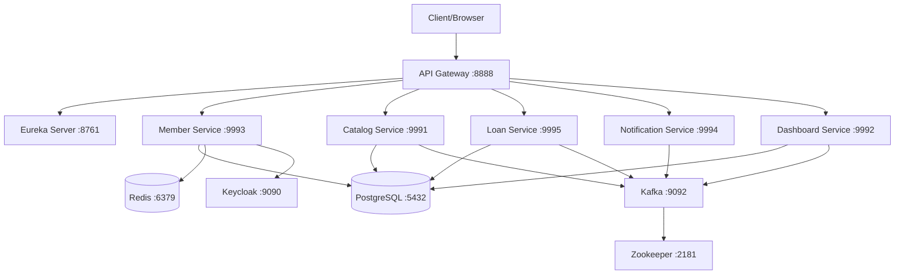

# 🚀 Hướng dẫn Deploy Hệ thống Quản lý Thư viện

## 📖 Tổng quan

Hệ thống Quản lý Thư viện được xây dựng theo kiến trúc microservices với Spring Boot và có thể deploy bằng Docker Compose một cách đơn giản.

## 🏗️ Kiến trúc Hệ thống



## 🛠️ Yêu cầu Hệ thống

### Phần mềm bắt buộc:
- **Docker** >= 20.10.0
- **Docker Compose** >= 2.0.0

### Phần mềm tùy chọn (để build từ source):
- **Java** >= 17
- **Maven** >= 3.8.0

### Yêu cầu phần cứng tối thiểu:
- **RAM**: 8GB (khuyến nghị 16GB)
- **CPU**: 4 cores
- **Disk**: 10GB dung lượng trống
- **Network**: Kết nối internet (để tải Docker images)

## 📋 Chuẩn bị Deploy

### 1. Clone repository
```bash
git clone <repository-url>
cd books
```

### 2. Cấu hình môi trường
```bash
# Copy file template environment
cp document/env-template.txt .env

# Chỉnh sửa file .env với các giá trị phù hợp
nano .env  # hoặc vim .env
```

### 3. Các biến môi trường quan trọng cần cập nhật:

```bash
# Database passwords (BẮT BUỘC thay đổi trong production)
POSTGRES_PASSWORD=your_secure_password_here
KEYCLOAK_DB_PASSWORD=your_keycloak_password_here

# JWT Secret (BẮT BUỘC thay đổi)
JWT_SECRET_KEY=your_very_long_and_secure_jwt_secret_key_here

# Email configuration (nếu cần gửi email)
MAIL_USERNAME=your_email@gmail.com
MAIL_PASSWORD=your_app_password

# Keycloak admin credentials
KEYCLOAK_ADMIN=admin
KEYCLOAK_ADMIN_PASSWORD=your_admin_password
```

## 🚀 Deploy Hệ thống

### Phương pháp 1: Deploy tự động (Khuyến nghị)

```bash
# Deploy toàn bộ hệ thống
./scripts/deploy.sh

# Hoặc với các tùy chọn
./scripts/deploy.sh --skip-build     # Bỏ qua build (nếu đã build)
./scripts/deploy.sh --skip-infra     # Bỏ qua infrastructure setup
```

### Phương pháp 2: Deploy thủ công

#### Bước 1: Build services
```bash
# Build tất cả services
mvn clean package -DskipTests

# Hoặc build từng service
cd member-service && mvn clean package -DskipTests && cd ..
cd catalog-service && mvn clean package -DskipTests && cd ..
# ... và các service khác
```

#### Bước 2: Khởi động infrastructure
```bash
# Khởi động database và messaging
docker-compose up -d postgres redis keycloak zookeeper kafka

# Đợi các services sẵn sàng (kiểm tra logs)
docker-compose logs -f postgres
```

#### Bước 3: Khởi động microservices
```bash
# Khởi động Eureka Server trước
docker-compose up -d eureka-server

# Đợi Eureka sẵn sàng, sau đó khởi động API Gateway
docker-compose up -d api-gateway

# Cuối cùng khởi động các business services
docker-compose up -d member-service catalog-service loan-service notification-service dashboard-service
```

## 🔍 Kiểm tra Deploy

### 1. Kiểm tra trạng thái containers
```bash
docker-compose ps
```

### 2. Kiểm tra health của các services
```bash
# API Gateway
curl http://localhost:8888/actuator/health

# Eureka Server
curl http://localhost:8761/actuator/health

# Member Service
curl http://localhost:9993/actuator/health

# Catalog Service
curl http://localhost:9991/actuator/health

# Loan Service
curl http://localhost:9995/actuator/health

# Notification Service
curl http://localhost:9994/actuator/health

# Dashboard Service
curl http://localhost:9992/actuator/health
```

### 3. Xem logs
```bash
# Xem logs tất cả services
docker-compose logs

# Xem logs của service cụ thể
docker-compose logs -f member-service

# Xem logs realtime
docker-compose logs -f --tail=100
```

## 🌐 Truy cập Hệ thống

| Service | URL | Mô tả |
|---------|-----|-------|
| **API Gateway** | http://localhost:8888 | Điểm vào chính của hệ thống |
| **Eureka Dashboard** | http://localhost:8761 | Service registry dashboard |
| **Keycloak Admin** | http://localhost:9090/admin | Identity management |
| **PostgreSQL** | localhost:5432 | Database |
| **Redis** | localhost:6379 | Cache |
| **Kafka** | localhost:9092 | Message broker |

### Thông tin đăng nhập mặc định:

**Keycloak Admin:**
- Username: `admin`
- Password: `admin_password_2024` (hoặc giá trị trong .env)

**PostgreSQL:**
- Username: `library_admin` (hoặc giá trị trong .env)
- Password: `library_secure_password_2024` (hoặc giá trị trong .env)
- Database: `library_db`

## 🛑 Dừng và Dọn dẹp

### Dừng services
```bash
# Dừng tất cả services
./scripts/stop.sh

# Hoặc chỉ dừng services (giữ lại containers)
./scripts/stop.sh --stop-only

# Hoặc sử dụng docker-compose
docker-compose down
```

### Dọn dẹp toàn bộ (bao gồm dữ liệu)
```bash
# CẢNH BÁO: Lệnh này sẽ xóa TẤT CẢ DỮ LIỆU
./scripts/stop.sh --full-cleanup
```

### Dọn dẹp thủ công
```bash
# Dừng và xóa containers
docker-compose down

# Xóa volumes (dữ liệu sẽ bị mất)
docker-compose down -v

# Xóa images
docker rmi $(docker images "library/*" -q)
```

## 🔧 Troubleshooting

### Các vấn đề thường gặp:

#### 1. Container không thể khởi động
```bash
# Kiểm tra logs
docker-compose logs [service-name]

# Kiểm tra port conflicts
netstat -tulpn | grep :[port]
```

#### 2. Database connection errors
```bash
# Kiểm tra PostgreSQL
docker-compose exec postgres pg_isready -U library_admin

# Kiểm tra environment variables
docker-compose exec member-service env | grep SPRING_DATASOURCE
```

#### 3. Kafka connection errors
```bash
# Kiểm tra Kafka
docker-compose exec kafka kafka-broker-api-versions --bootstrap-server localhost:19092

# Kiểm tra Zookeeper
docker-compose exec zookeeper nc -z localhost 2181
```

#### 4. Memory issues
```bash
# Kiểm tra memory usage
docker stats

# Giảm memory allocation trong docker-compose.yml
# Hoặc tăng memory cho Docker Desktop
```

#### 5. Port conflicts
```bash
# Tìm process sử dụng port
lsof -i :8888

# Thay đổi port trong .env file
API_GATEWAY_PORT=8889
```

### Debugging commands:

```bash
# Vào container để debug
docker-compose exec member-service sh

# Kiểm tra network connectivity
docker-compose exec member-service ping postgres

# Kiểm tra environment variables
docker-compose exec member-service env

# Xem resource usage
docker-compose exec member-service top
```

## 📊 Monitoring và Logs

### Xem logs realtime
```bash
# Tất cả services
docker-compose logs -f

# Specific service
docker-compose logs -f member-service

# Với timestamp
docker-compose logs -f -t

# Last 100 lines
docker-compose logs -f --tail=100
```

### Monitoring resources
```bash
# Docker stats
docker stats

# Compose stats
docker-compose top
```

## 🔒 Security Notes

### Production deployment:
1. **Thay đổi tất cả passwords mặc định**
2. **Sử dụng HTTPS** cho API Gateway
3. **Cấu hình firewall** cho các ports
4. **Sử dụng secrets management** thay vì environment variables
5. **Enable SSL** cho PostgreSQL và Redis
6. **Cấu hình network policies** cho containers
7. **Regular security updates** cho Docker images

### Network Security:
```bash
# Chỉ expose necessary ports
# Trong docker-compose.yml, comment out ports không cần thiết
```

## 📈 Performance Tuning

### JVM Tuning:
Các Dockerfile đã được tối ưu với:
- **G1GC** garbage collector
- **Container-aware** memory settings
- **MaxRAMPercentage** instead of fixed Xmx

### Database Tuning:
```sql
-- PostgreSQL configuration (trong scripts/init-db.sql)
shared_preload_libraries = 'pg_stat_statements'
max_connections = 200
shared_buffers = 256MB
effective_cache_size = 1GB
```

### Monitoring Setup:
Để setup monitoring production, consider:
- **Prometheus + Grafana**
- **ELK Stack** for logs
- **Jaeger** for distributed tracing

## 🤝 Đóng góp

1. Fork repository
2. Tạo feature branch: `git checkout -b feature/new-feature`
3. Commit changes: `git commit -am 'Add new feature'`
4. Push branch: `git push origin feature/new-feature`
5. Tạo Pull Request

## 📞 Hỗ trợ

Nếu gặp vấn đề trong quá trình deploy:

1. **Kiểm tra logs** của services có vấn đề
2. **Xem phần Troubleshooting** ở trên
3. **Tạo issue** trên GitHub với logs đầy đủ
4. **Liên hệ team** qua email hoặc Slack

---

**Happy Deploying! 🎉**
